# 💬 Inquisitor Chatbot — Conversation Flow Design Specification
**Group AI_07 — Member 3: Conversation Flow Designer**  
**Project:** Inquisitor Chatbot (Track 1) — University of Engineering & Technology (UET), Lahore  
**Target Audience:** Students, Faculty/Teachers, Mentors, Companies, and Guests  
**Integration Scope:** Works with Member 2 (Knowledge Base), Member 4 (Frontend UI), Member 5 (Backend/API), Member 6 (LLM/RAG), Member 7 (Testing)

---

## 📋 1. Executive Summary & Design System

### 1.1 Role & Objective
As **Member 3 (Conversation Flow Designer)**, the responsibility is to map, structure, and optimize all conversational paths between users and the Inquisitor Chatbot. The design ensures that user queries are resolved accurately, efficiently, and gracefully—while strictly adhering to the verified Knowledge Base provided by Member 2.

### 1.2 Bot Persona & Tone Guidelines
- **Identity:** *Inquisitor Assistant* — The official intelligent helper for the Inquisitors Society, UET Lahore.
- **Tone:** Welcoming, helpful, professional, clear, and structured.
- **Formatting:** Uses clean bullet points, bold key terms, quick reply chips/buttons, and direct navigation links where available.
- **Guardrails:** Friendly transparency. If information is unavailable or unverified (e.g., specific event dates, fees, stipends), the bot immediately admits non-possession and provides official human support contacts without making assumptions.

---

## 🗂️ 2. Intent Taxonomy & Slot Architecture

### 2.1 Primary Intent Categories
| Intent Code | Category Name | Description | Key Slots / Entities |
|---|---|---|---|
| `INT_GREETING` | Onboarding & Navigation | Welcomes user, presents broad capabilities and suggested menu | `user_type`, `user_name` |
| `INT_MEMBERSHIP_INFO` | Membership Eligibility & Rules | Explains free membership for UET students, rules, email verification | `student_status`, `university_email` |
| `INT_INTERNSHIP_EXPLORE` | Internship Program 2026 | Explains virtual/hybrid tracks, AI tools, technical/soft skills | `internship_type`, `focus_area` |
| `INT_INTERNSHIP_APPLY` | Internship Application | Directs to official application portal, states July 12 2026 deadline rule | `application_status` |
| `INT_COURSE_INFO` | Courses & Learning | Explains course catalog, rules (max 5/sem, 60% completion, 80% attendance) | `course_name`, `prerequisites` |
| `INT_CERTIFICATE_VERIFY` | Digital Certificates | Explains certificate rules, QR code verification, forgery protection | `certificate_id` |
| `INT_EVENT_INFO` | Events & Competitions | Provides event types, 24h registration rule, entry verification | `event_type` |
| `INT_OUTREACH_INFO` | Orphanage Outreach & Community | Information about social impact activities, Google Form reg, WhatsApp link | `activity_type` |
| `INT_CAREER_GUIDANCE` | Career & Mentorship | Explains job board, portfolio review, mock interviews | `career_topic` |
| `INT_HUMAN_SUPPORT` | Contact & Escalation | Directs to official email `info@inquisitorssociety.org` & phone `+92 (309) 868-8664` | `query_summary` |
| `INT_FALLBACK` | Missing Info / Off-Topic | Safely triggers standard fallback response | `unrecognized_query` |

---

## 🔄 3. Complete Conversation Flows (End-to-End Dialogue Trees)

---

### Flow 1: Greeting, Scope Introduction & Interactive Main Menu (`INT_GREETING`)

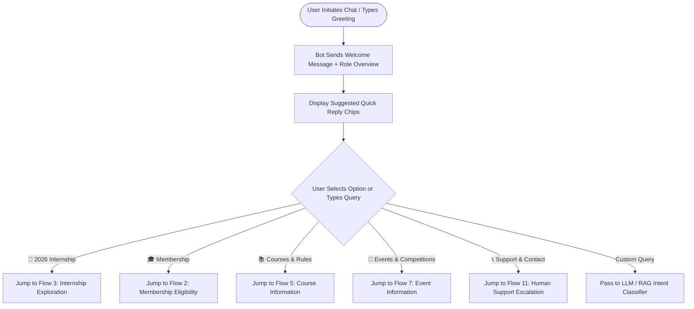

#### Dialogue State & Transcript Example
- **User:** "Hi, hello!"
- **Bot:**
  > 👋 **Welcome to Inquisitors Society Chatbot!**  
  > I am your official assistant for technical events, internships, courses, memberships, and society guidance at UET Lahore.
  > 
  > How can I assist you today? Select an option below or ask me directly:
- **UI Quick Reply Chips (Member 4):**
  - `[🚀 2026 Internship Program]` `[🎓 Society Membership]` `[📚 Courses & Rules]` `[📅 Events & Rules]` `[🤝 Community Outreach]` `[📞 Human Support]`

---

### Flow 2: Society Membership Inquiries & Eligibility (`INT_MEMBERSHIP_INFO`)

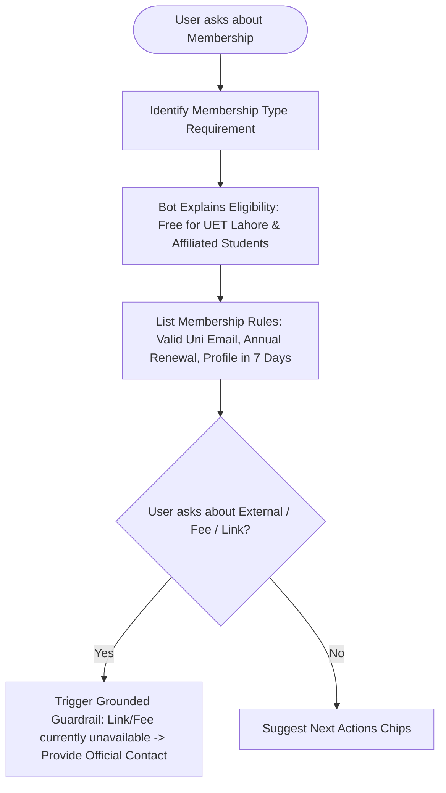

#### Dialogue State & Transcript Example
- **User:** "How can I join Inquisitors Society? Is it free?"
- **Bot:**
  > 🎓 **Inquisitors Society Membership Information**  
  > 
  > • **Eligibility:** Membership is **100% FREE** for students of UET Lahore and affiliated institutions.  
  > • **Verification:** A valid university email address is required for verification.  
  > • **Profile Completion:** Members must complete their profile within **7 days** of registration.  
  > • **Renewal:** Membership is renewed annually at the beginning of the academic year.  
  > 
  > 📌 *Note for External Members:* Specific external registration fees and current registration links must be confirmed through official channels.
- **UI Quick Reply Chips:**
  - `[🚀 Explore 2026 Internships]` `[📚 View Course Rules]` `[📞 Contact Support]`

---

### Flow 3: Internship Program 2026 Exploration (`INT_INTERNSHIP_EXPLORE`)

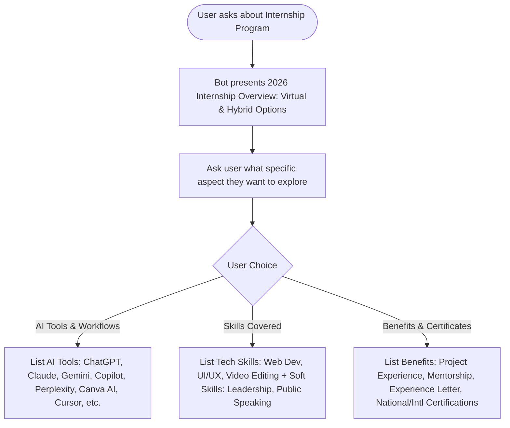

#### Dialogue State & Transcript Example
- **User:** "What will I learn in the 2026 Internship Program?"
- **Bot:**
  > 🚀 **INQUISITORS Society Internship Program 2026**  
  > The program offers both **Virtual** and **Hybrid** tracks, open to students of all universities and disciplines.  
  > 
  > **Core Learning Focus:**  
  > 🛠️ **AI Tools Covered:** ChatGPT, Claude AI, Google Gemini, MS Copilot, Perplexity AI, Canva AI, Gamma AI, Notion AI, ElevenLabs, Lovable AI, Bolt.new, Cursor AI, GitHub Copilot & Midjourney.  
  > 🤖 **AI Workflows:** Prompt Engineering, AI-assisted Research, Automation, Content & Graphic Design Workflows.  
  > 💻 **Technical & Soft Skills:** Web Development, UI/UX Design, Project Management, Leadership, Teamwork & Interview Prep.  
  > 
  > Would you like to know how to apply or view the certifications offered?
- **UI Quick Reply Chips:**
  - `[📝 How to Apply]` `[📜 Internship Certifications]` `[🎁 Internship Benefits]`

---

### Flow 4: Internship Application & Deadline Guardrail (`INT_INTERNSHIP_APPLY`)

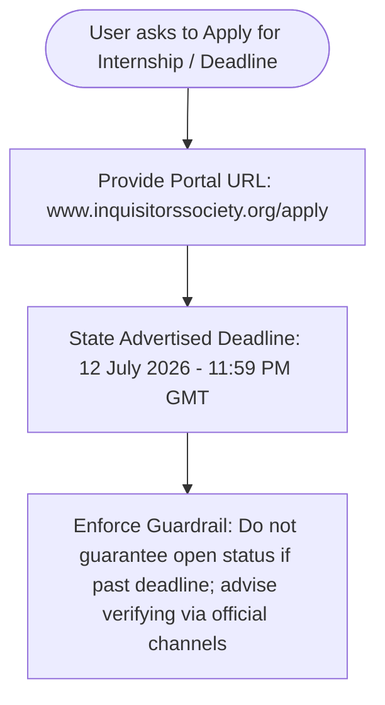

#### Dialogue State & Transcript Example
- **User:** "Can I still apply for the 2026 internship?"
- **Bot:**
  > 📝 **Internship Application Details**  
  > 
  > • **Official Application Portal:** [www.inquisitorssociety.org/apply](https://www.inquisitorssociety.org/apply)  
  > • **Advertised Deadline:** July 12, 2026 — 11:59 PM (GMT)  
  > • **Availability:** Limited Seats Available.  
  > 
  > ⚠️ *Important Note:* The advertised application deadline was July 12, 2026. If you are applying after this date, please check the official portal or contact Inquisitors Society directly to confirm current intake status or extension announcements.
- **UI Quick Reply Chips:**
  - `[🌐 Visit Application Link]` `[✉️ Contact Official Team]` `[⬅️ Back to Main Menu]`

---

### Flow 5: Course Enrollment, Rules & Requirements (`INT_COURSE_INFO`)

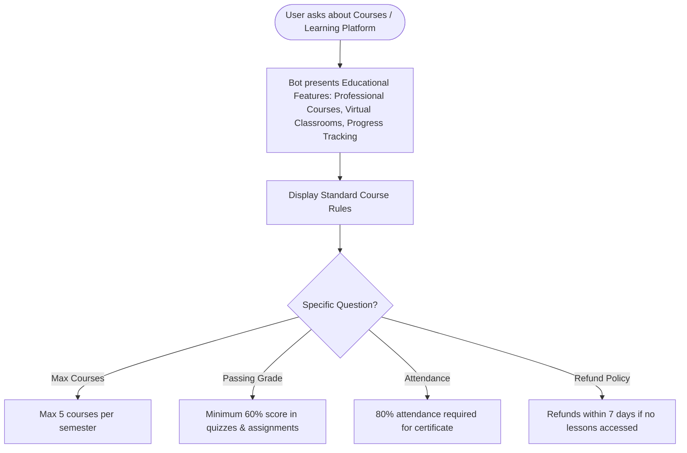

#### Dialogue State & Transcript Example
- **User:** "What are the rules for taking courses on the platform?"
- **Bot:**
  > 📚 **Course Enrollment & Academic Rules**  
  > 
  > 1. **Course Limit:** Students can enroll in a maximum of **5 courses per semester**.  
  > 2. **Prerequisites:** Prerequisite courses must be completed before enrolling in advanced modules.  
  > 3. **Completion Requirement:** Minimum **60% overall score** in quizzes and assignments.  
  > 4. **Attendance Requirement:** **80% attendance** is strictly required for certificate eligibility.  
  > 5. **Refund Policy:** Paid courses allow refunds within **7 days** of enrollment, provided no lessons have been accessed.  
- **UI Quick Reply Chips:**
  - `[📜 Certificate Rules]` `[🎓 Membership Info]` `[💬 Ask Another Question]`

---

### Flow 6: Digital Certificates & Verification Flow (`INT_CERTIFICATE_VERIFY`)

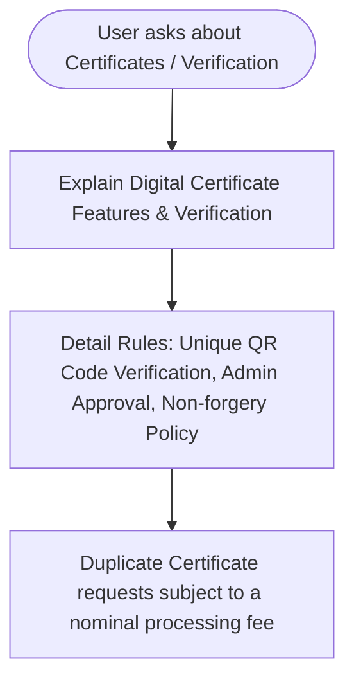

#### Dialogue State & Transcript Example
- **User:** "How do I verify my certificate?"
- **Bot:**
  > 📜 **Digital Certificate System**  
  > 
  > • **Verification:** Every digital certificate issued by Inquisitors Society contains a unique **QR code** for instant online verification.  
  > • **Validity:** Digital certificates remain valid indefinitely unless revoked.  
  > • **Security:** Certificates are tamper-proof and cannot be altered or forged.  
  > • **Duplicates:** Duplicate certificate requests can be submitted subject to an administrative fee.
- **UI Quick Reply Chips:**
  - `[📚 Course Rules]` `[🚀 Internship Certifications]` `[📞 Support]`

---

### Flow 7: Events, Workshops & Competitions (`INT_EVENT_INFO`)

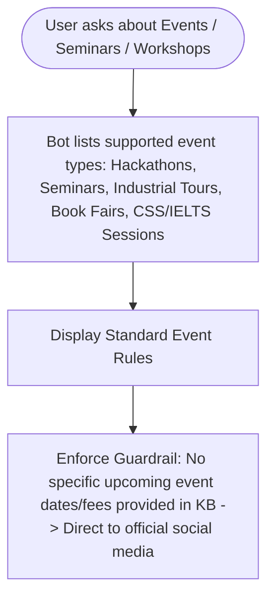

#### Dialogue State & Transcript Example
- **User:** "When is the next hackathon or workshop?"
- **Bot:**
  > 📅 **Inquisitors Society Events & Activities**  
  > We host seminars, workshops, hackathons, conferences, industrial tours, CSS/IELTS sessions, and book fairs.  
  > 
  > **General Event Rules:**  
  > • **Registration Cutoff:** Closes **24 hours** before event start time.  
  > • **Entry:** QR codes are issued for single-entry event verification.  
  > • **Certificates:** Issued only to registered attendees who participate.  
  > • **Refunds:** Paid event fees are non-refundable unless the event is cancelled.  
  > 
  > 📢 *Current Upcoming Events:* To check the latest schedule, dates, and venues, please follow our official social media channels or WhatsApp Channel!
- **UI Quick Reply Chips:**
  - `[🔗 Official Social Media Links]` `[🤝 Orphanage Outreach]` `[📞 Contact Us]`

---

### Flow 8: Community Activities & Orphanage Outreach (`INT_OUTREACH_INFO`)

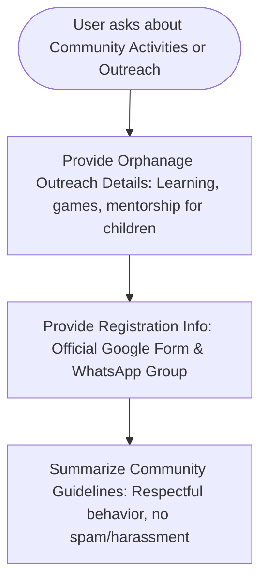

#### Dialogue State & Transcript Example
- **User:** "Tell me about the Orphanage Outreach program."
- **Bot:**
  > 🤝 **INQUISITORS SOCIETY | ORPHANAGE OUTREACH**  
  > 
  > • **Purpose:** Spreading joy, mentorship, care, interactive games, and learning activities for children.  
  > • **Planned Activities:** Learning sessions, fun games, active mentorship, interaction, and emotional support.  
  > • **How to Participate:** Registration is conducted via the official Google Form, and participants join the dedicated WhatsApp group for coordination.  
  > 
  > Would you like the official contact information to get involved?
- **UI Quick Reply Chips:**
  - `[📞 Contact Information]` `[📱 Social Media Links]` `[⬅️ Main Menu]`

---

### Flow 9: Career Development & Mentorship Guidance (`INT_CAREER_GUIDANCE`)

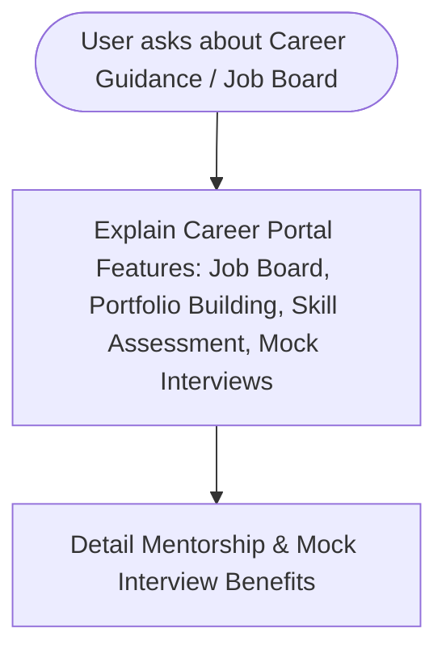

#### Dialogue State & Transcript Example
- **User:** "Does the society help with jobs or resume building?"
- **Bot:**
  > 💼 **Career Development & Guidance**  
  > 
  > The Inquisitors platform provides dedicated career features:  
  > • **Job Board:** Access internship and job postings from partner companies.  
  > • **Portfolio & Resume:** Portfolio building assistance and LinkedIn optimization.  
  > • **Mock Interviews:** Conducted by experienced mentors to prepare you for real-world hiring.  
  > • **Skill Assessment:** Guidance and career resources to bridge technical skill gaps.
- **UI Quick Reply Chips:**
  - `[🚀 2026 Internship Program]` `[🎓 Mentorship Info]` `[📞 Contact Us]`

---

### Flow 10: General FAQs & Quick Inquiries (`INT_FAQ`)

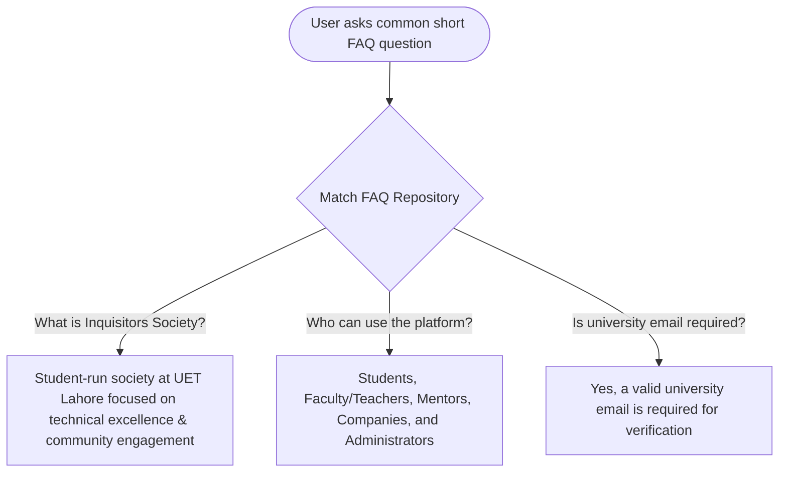

#### Dialogue State & Transcript Example
- **User:** "Who can use the platform?"
- **Bot:**
  > 🌐 **Platform Users**  
  > The Inquisitor platform is designed to support 5 user types:  
  > 1. **Students:** Access courses, apply for internships, build portfolios, join discussions.  
  > 2. **Teachers/Faculty:** Manage courses, conduct virtual classes, evaluate work.  
  > 3. **Mentors:** Guide students, evaluate applications, provide feedback.  
  > 4. **Companies:** Post internships, review applications, recruit talent.  
  > 5. **Administrators:** Platform operations, analytics, user management.

---

### Flow 11: Fallback, Missing Info & Human Support Escalation (`INT_HUMAN_SUPPORT` / `INT_FALLBACK`)

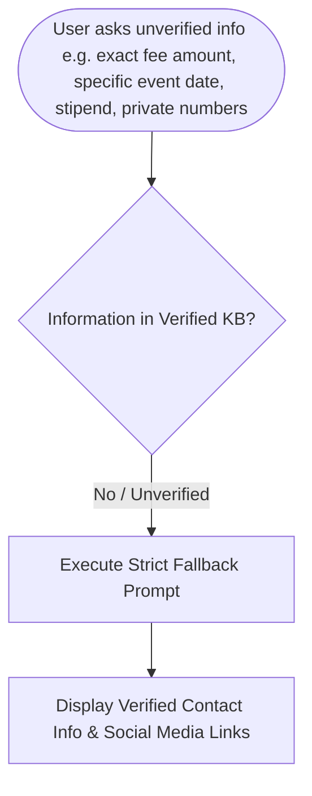

#### Dialogue State & Transcript Example
- **User:** "What is the exact registration fee for external members next month?"
- **Bot:**
  > 🤖 **Verified Information Notice**  
  > 
  > *"I'm sorry, but I don't have verified information about that at the moment. Please contact Inquisitors Society at info@inquisitorssociety.org or through its official social-media channels for assistance."*  
  > 
  > 📌 **Official Verified Contacts:**  
  > • **Email:** `info@inquisitorssociety.org`  
  > • **Phone:** `+92 (309) 868-8664`  
  > • **Facebook:** [facebook.com/INQUISITORSSOCIETY](https://facebook.com/INQUISITORSSOCIETY/)  
  > • **Instagram:** [instagram.com/inquisitorssociety](https://instagram.com/inquisitorssociety/)
- **UI Quick Reply Chips:**
  - `[📧 Send Email]` `[📱 WhatsApp Channel]` `[🏠 Back to Main Menu]`

---

### Flow 12: Edge Cases, Off-Topic & Error Recovery Flow

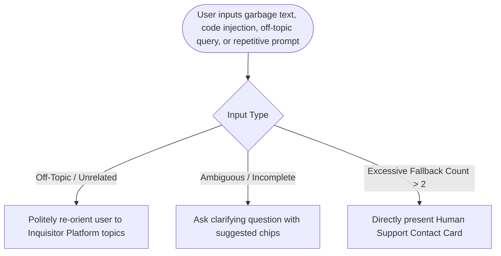

#### Dialogue State & Transcript Example
- **User:** "Can you solve my calculus homework?"
- **Bot:**
  > 💡 I am specialized in assisting with **Inquisitors Society platform services**, including courses, memberships, 2026 internships, events, and community programs at UET Lahore.  
  > 
  > I cannot help with external homework. Please choose a topic below to explore:
- **UI Quick Reply Chips:**
  - `[🚀 2026 Internship]` `[📚 Course Rules]` `[🎓 Membership]` `[📞 Human Support]`

---

## 🎨 4. Frontend UI Interaction Specifications (For Member 4)

To ensure seamless integration with Member 4 (Frontend UI Developer), the following UI component specs are defined:

1. **Suggested Question Chips:**
   - Always rendered below the latest bot message.
   - Horizontal scrolling container on mobile.
   - Clicking a chip immediately submits the exact text payload as user input.

2. **Card Layouts for Responses:**
   - **Contact Card:** Structured container with clickable email (`mailto:`) and phone (`tel:`) links.
   - **Internship Spotlight Card:** Visual header with virtual/hybrid badge, list of AI tool icons, and application link button.

3. **Fallback / Escalation Banner:**
   - Displayed when `INT_FALLBACK` is triggered twice consecutively.
   - Includes a high-contrast button: **"Connect with Human Support"**.

---

## 🧠 5. LLM State & System Prompt Directives (For Member 6)

1. **Context Window Persistence:**
   - Maintain active dialogue state (`current_intent`, `user_type`, `fallback_counter`).
   - If `fallback_counter >= 2`, force `INT_HUMAN_SUPPORT` escalation.

2. **Strict RAG Grounding Rule:**
   - Never generate hallucinated links, prices, dates, or stipends.
   - If knowledge base retrieval returns confidence < 0.65, immediately inject standard fallback phrasing from Section 23 of Member 2's document.

---

## 🧪 6. Test Scenario Mapping (For Member 7)

| Test Case ID | Test Category | Query Input | Expected Intent | Expected Flow |
|---|---|---|---|---|
| `TC_01` | Normal | "How can I apply for internship?" | `INT_INTERNSHIP_APPLY` | Flow 4 |
| `TC_02` | Normal | "Is membership free for UET students?" | `INT_MEMBERSHIP_INFO` | Flow 2 |
| `TC_03` | Edge Case | "What is the exact external fee?" | `INT_FALLBACK` | Flow 11 (Fallback rule enforced) |
| `TC_04` | Complex | "Can I take 6 courses this semester?" | `INT_COURSE_INFO` | Flow 5 (States max 5 limit) |
| `TC_05` | Out-of-Scope | "Who won the cricket match yesterday?" | `INT_OFF_TOPIC` | Flow 12 (Re-orientation) |
