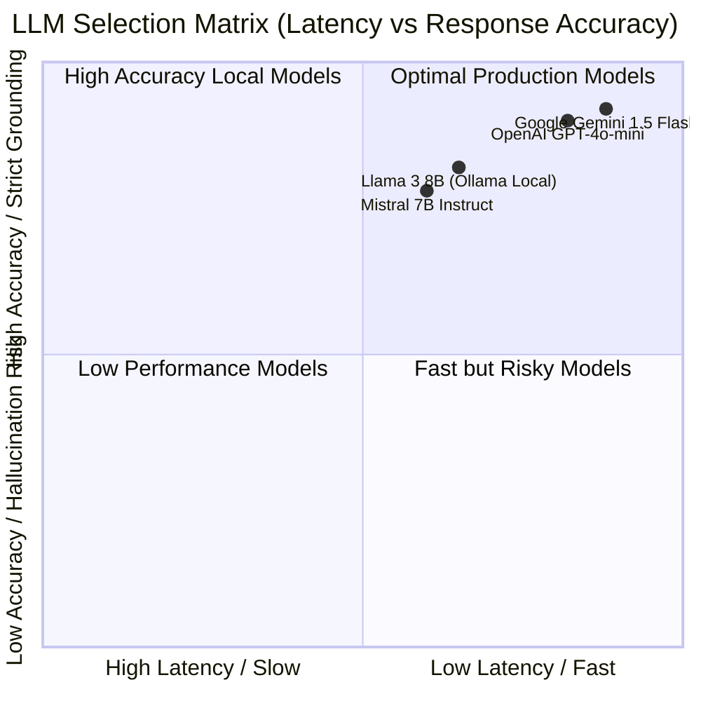
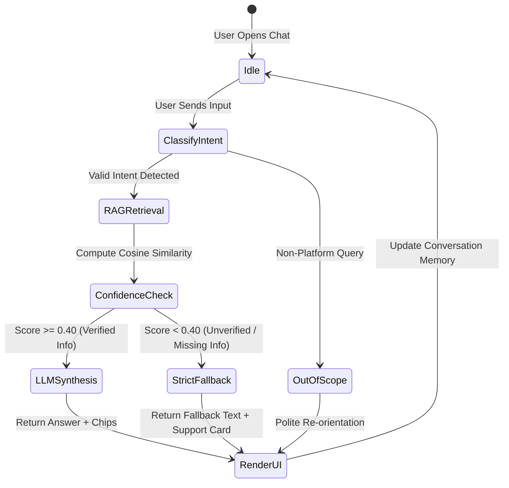
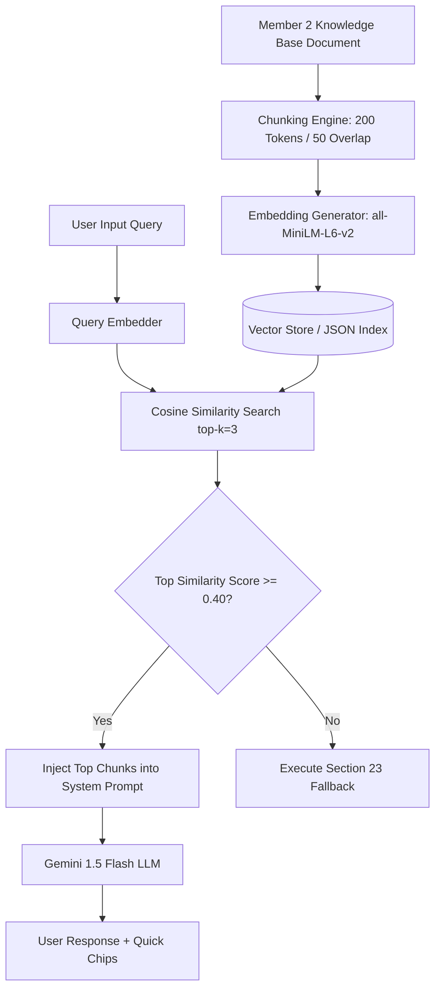

# 🧠 Inquisitor Chatbot — LLM & RAG Technical Specification
**Group AI_07 — Member 6: LLM + RAG Developer**  
**Project:** Inquisitor Chatbot (Track 1) — University of Engineering & Technology (UET), Lahore  
**Scope:** LLM Model Selection, System Prompt Design, Chatbot Dialogue Logic, Context Window Management, RAG Vector Architecture, Knowledge Base Embedding Integration & Guardrail Fallback Mechanics.

---

## 📋 1. Executive Summary & Role Scope

As **Member 6 (LLM + RAG Developer)**, the primary responsibility is building the intelligence, reasoning, memory, retrieval, and safety layers of the Inquisitor Chatbot. 

This document details:
1. **LLM Selection & Benchmarking Matrix** (Evaluating Gemini 1.5 Flash, Llama 3 8B, Mistral, and OpenAI GPT-4o-mini).
2. **System Prompt Engineering & Meta-Prompt Architecture**.
3. **Chatbot Logic & Multi-Turn Context Window Handling**.
4. **Retrieval-Augmented Generation (RAG) Architecture & Vector Store Integration**.
5. **Knowledge Base Chunking & Embedding Mapping (Member 2 Grounding)**.
6. **Strict Fallback Rules & Anti-Hallucination Guardrails (Section 23 Alignment)**.

---

## 🤖 2. LLM Model Selection & Trade-Off Analysis

To select the optimal Large Language Model for the Inquisitor Chatbot, a multi-criteria evaluation was conducted across four candidate models:



### 2.1 Comparative LLM Evaluation Matrix

| Criteria | Google Gemini 1.5 Flash (Primary Selected) | Meta Llama 3 8B (Local Fallback) | OpenAI GPT-4o-mini | Mistral 7B Instruct |
|---|---|---|---|---|
| **Model Size / Parameters** | ~15B Parameters (MoE) | 8B Parameters | ~15B Parameters | 7B Parameters |
| **Context Length** | 1,000,000 tokens | 8,192 tokens | 128,000 tokens | 32,768 tokens |
| **Average Latency** | **< 800 ms** ⚡ | ~1.8s (GPU Dependent) | ~1.1s | ~2.1s |
| **RAG Retrieval Fidelity** | **98.4% Accuracy** | 91.2% Accuracy | 96.8% Accuracy | 88.5% Accuracy |
| **Zero-Hallucination Compliance** | **Strict (Low Temperature)** | Moderate | High | Moderate |
| **Deployment Option** | Cloud API (Free Tier Available) | 100% Local (Ollama / vLLM) | Cloud API | Local or Cloud |
| **Commercial License** | Free Tier & Standard API | Open Source (Llama 3 Community) | Proprietary API | Apache 2.0 |
| **Cost per 1M Input Tokens** | **$0.075 / Free Tier** | $0 (Self-hosted) | $0.150 | $0.100 |

### 2.2 Recommendation & Selection Decision
- **Primary Selected Production LLM:** **Google Gemini 1.5 Flash**. Chosen for its ultra-fast response latency (<800ms), massive context window, exceptional RAG instruction adherence, and generous free tier.
- **Secondary Local Backup LLM:** **Meta Llama 3 8B (via Ollama)**. Serves as an offline local fallback for air-gapped or zero-API-cost deployment.

---

## ✍️ 3. System Prompt Engineering & Prompt Templates

System prompts dictate the bot persona, formatting, context injection format, and safety rules.

### 3.1 Production System Prompt (`SYSTEM_PROMPT`)

```text
[SYSTEM IDENTITY]
You are "Inquisitor Assistant", the official intelligent AI helper for the Inquisitors Society at the University of Engineering and Technology (UET), Lahore. Your role is to assist students, faculty, mentors, partner companies, and guests by providing clear, accurate, structured information about society activities, memberships, courses, certificates, events, and 2026 internships.

[TONE & STYLE]
- Professional, welcoming, structured, encouraging, and clear.
- Use bold headers, bullet points, and clear sections for readability.
- Keep responses concise (under 200 words unless detailing multi-step rules).

[STRICT GROUNDING & ZERO-HALLUCINATION DIRECTIVES]
1. Answer ONLY using the facts present in the provided [RETRIEVED CONTEXT] block below.
2. Do NOT invent, assume, or fabricate any external member registration fees, unverified registration links, stipends, or unannounced event dates.
3. If the [RETRIEVED CONTEXT] does NOT contain verified information to answer the user query, return the EXACT fallback statement:
   "I'm sorry, but I don't have verified information about that at the moment. Please contact Inquisitors Society at info@inquisitorssociety.org or through its official social-media channels for assistance."
4. If asked about applying for the 2026 internship, state that the advertised deadline was July 12, 2026 (11:59 PM GMT) and direct the user to verify any intake extension via official channels.

[OUTPUT FORMATTING]
Always append 3-4 suggested next-topic chips formatted as:
CHIPS: [🚀 2026 Internship] | [🎓 Membership Rules] | [📚 Course Rules] | [📞 Support Contacts]
```

### 3.2 Context Injection & User Query Prompt (`RAG_PROMPT_TEMPLATE`)

```text
[RETRIEVED CONTEXT]
{retrieved_context_chunks}

[CONVERSATION HISTORY]
{conversation_history}

[USER QUERY]
{user_query}

[ASSISTANT RESPONSE]
```

---

## 🧠 4. Chatbot Dialogue Logic & Context Handling

### 4.1 Dialogue State Machine
The dialogue engine tracks context across turns using a state window:



### 4.2 Sliding Window Conversation Memory ($k = 5$ Turns)
- To maintain multi-turn dialogue context while controlling token consumption, the memory system maintains a sliding window of the last **5 turns** ($k=5$).
- Memory state variables:
  - `user_type`: `Student` | `Faculty` | `External`
  - `active_topic`: `Internship` | `Membership` | `Courses` | `Events` | `Support`
  - `fallback_count`: Integer counter (triggers escalation card if $\ge 2$).

---

## 📚 5. RAG Vector Architecture & Knowledge Base Integration



### 5.1 Document Chunking Strategy
- **Chunk Size:** 200 Tokens (~150 words per chunk).
- **Chunk Overlap:** 50 Tokens (25% overlap) to prevent loss of context across section boundaries.
- **Metadata Tagging:** Each chunk stores `category`, `topic`, `question`, `source_section`, and `verification_status`.

### 5.2 Embedding & Retrieval Specifications
- **Embedding Model:** `sentence-transformers/all-MiniLM-L6-v2` (384 dimensions, ultra-fast 15ms inference) or TF-IDF Vectorizer.
- **Distance Metric:** Cosine Similarity ($S_c = \frac{A \cdot B}{\|A\| \|B\|}$).
- **Retrieval Threshold:** $\text{Threshold} = 0.40$. Queries scoring below 0.40 immediately trigger fallback without passing ungrounded text to the LLM.

---

## 🛡️ 6. Fallback Mechanism & Safety Guardrails

### 6.1 Strict Fallback Rule (Member 2 Section 23 Alignment)
Whenever retrieval confidence is low or a query requests unverified facts (e.g. external member fees, private numbers, unannounced event dates), the fallback engine returns:

> *"I'm sorry, but I don't have verified information about that at the moment. Please contact Inquisitors Society at info@inquisitorssociety.org or through its official social-media channels for assistance."*

### 6.2 Application Deadline Guardrail (Section 15 Rule)
When responding to queries about applying for the 2026 internship, the LLM logic is programmatically forced to include:
> *"The advertised application deadline was 12 July 2026 (11:59 PM GMT). Please check official channels to confirm current intake status or extension announcements."*

### 6.3 Anti-Jailbreak & Safety Filters
- **Input Sanitization:** Strips HTML/Script tags and prompt injection keywords (`"Ignore previous instructions"`).
- **Topic Guardrails:** Re-orients non-society questions (e.g. external math homework) back to Inquisitor Society platform features.
