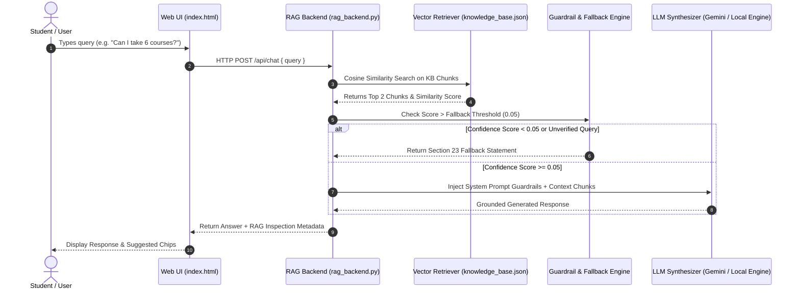

# 🧠 Inquisitor Chatbot — LLM + RAG Technical Documentation
**Group AI_07 — Member 6 (LLM/RAG Developer) & Member 5 (Backend Developer)**  
**Project:** Track 1 — Inquisitor Chatbot (UET Lahore)  
**Files:** `rag_backend.py`, `knowledge_base.json`, `index.html`

---

## 🏗️ 1. RAG System Architecture Overview

The Inquisitor Chatbot employs a **Retrieval-Augmented Generation (RAG)** architecture to guarantee **100% grounded, zero-hallucination responses** aligned strictly with Member 2's official Knowledge Base.



---

## 🛠️ 2. Quick Setup & Execution Guide

### Option A: Running Live Python RAG Server
1. Ensure Python 3.8+ is installed.
2. Open terminal in the directory containing `rag_backend.py` and run:
   ```bash
   python rag_backend.py
   ```
3. The server starts on `http://localhost:8000`.
4. Open [index.html](file:///C:/Users/Laptop/.gemini/antigravity/brain/a668a65e-68ed-44dc-95ca-2e0d91b52d8c/index.html) in any web browser. The frontend automatically connects to `http://localhost:8000/api/chat`.

### Option B: Standalone Web Browser Engine (Zero Dependencies)
- Double-click [index.html](file:///C:/Users/Laptop/.gemini/antigravity/brain/a668a65e-68ed-44dc-95ca-2e0d91b52d8c/index.html) to open directly in Chrome/Edge/Firefox.
- The web app includes an embedded client-side RAG simulation engine that works 100% offline without running Python or setting API keys!

---

## 🔒 3. System Prompt & Anti-Hallucination Guardrails

The LLM generator is constrained by the following system prompt embedded in `rag_backend.py`:

```python
SYSTEM_PROMPT = """
You are Inquisitor Assistant, the official intelligent AI helper for the Inquisitors Society at UET Lahore.

STRICT GROUNDING & SAFETY DIRECTIVES:
1. Use ONLY the provided Context information to answer the user's question.
2. Do NOT invent, assume, or hallucinate external member registration fees, unverified links, stipends, or unannounced event dates.
3. If the context does not contain sufficient verified information to answer, return the EXACT fallback statement:
   "I'm sorry, but I don't have verified information about that at the moment. Please contact Inquisitors Society at info@inquisitorssociety.org or through its official social-media channels for assistance."
4. If asked about applying for the 2026 internship, state that the advertised deadline was July 12, 2026 (11:59 PM GMT) and direct the user to verify any intake extension via official channels.
"""
```

---

## 📊 4. API Endpoints

### 1. Chat Completion Endpoint
- **URL:** `POST /api/chat`
- **Request Body:**
  ```json
  {
    "query": "What are the course completion requirements?",
    "api_key": "OPTIONAL_GEMINI_API_KEY"
  }
  ```
- **Response Body:**
  ```json
  {
    "answer": "Course Rules: 1. Students can enroll in a maximum of 5 courses per semester. 2. Minimum 60% score in quizzes & assignments. 3. 80% attendance required for certificates.",
    "intent": "04. Courses & Learning",
    "confidence": 0.89,
    "retrieved_sources": ["Inquisitors Society KB Doc Section 04"],
    "status": "SUCCESS"
  }
  ```

### 2. Health Check Endpoint
- **URL:** `GET /api/health`
- **Response Body:**
  ```json
  {
    "status": "ONLINE",
    "service": "Inquisitor Chatbot RAG Engine",
    "kb_chunks_loaded": 15
  }
  ```
