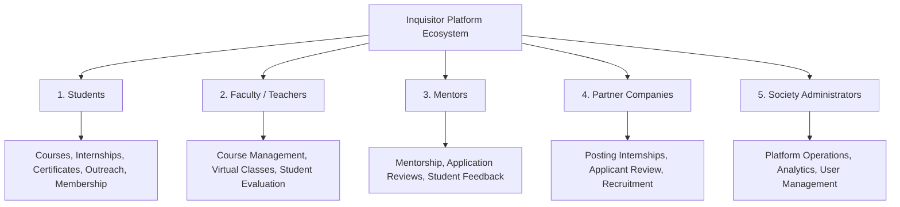
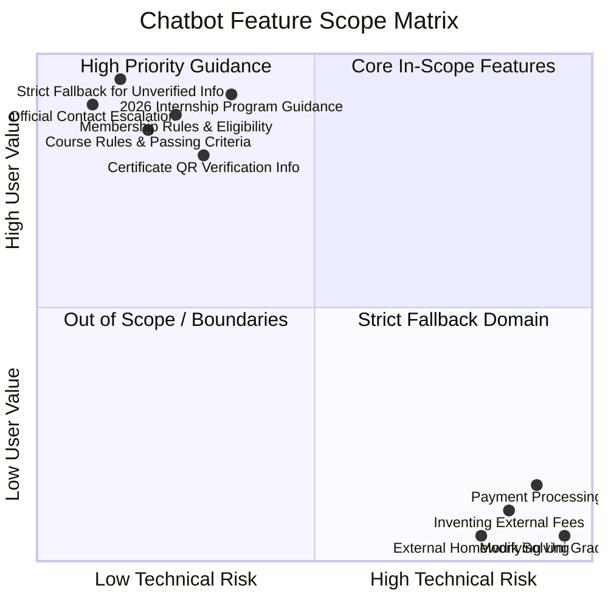
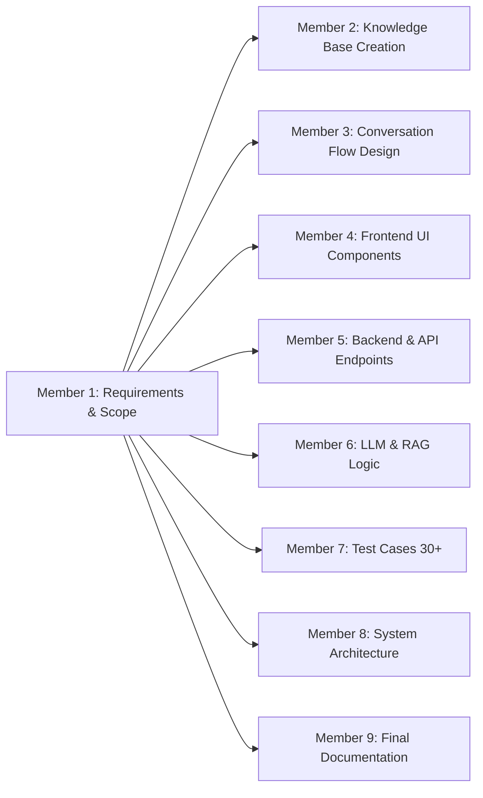

# 🔎 Inquisitor Chatbot — Requirements Analysis & Scope Specification
**Group AI_07 — Member 1: Requirement Analyst**  
**Project:** Inquisitor Chatbot (Track 1) — University of Engineering & Technology (UET), Lahore  
**Document Target:** Requirements Specification, Target User Analysis, System Boundaries & Scope Definition  
**Integration Scope:** Foundation document for Member 2 (KB), Member 3 (Flows), Member 4 (UI), Member 5 (Backend), Member 6 (LLM/RAG), Member 7 (Testing), Member 8 (Architecture), Member 9 (Presentation).

---

## 📋 1. Executive Summary & Project Purpose

### 1.1 Project Objective
The objective of the **Inquisitor Chatbot** project is to design, develop, and deploy an intelligent, context-aware conversational assistant for the **Inquisitors Society** platform at the University of Engineering and Technology (UET), Lahore. The chatbot serves as the primary automated guide for students, faculty, mentors, partner companies, and guests seeking information regarding society activities, memberships, internship programs, courses, certifications, events, and support.

### 1.2 Role of Member 1 (Requirement Analyst)
As **Member 1**, the primary responsibility is to:
1. Conduct thorough research into the Inquisitors Society platform ecosystem.
2. Identify and profile all target user personas and stakeholder groups.
3. Analyze core user problems, pain points, and high-frequency queries.
4. Define explicit **In-Scope** features and **Out-of-Scope** operational boundaries.
5. Formulate Functional (FR) and Non-Functional Requirements (NFR) to guide backend, frontend, RAG, and testing development.

---

## 🎯 2. Target Users & Stakeholder Matrix

The Inquisitor platform caters to five core user types, each with distinct information needs and interaction goals:

### 2.1 Detailed Persona Breakdown

| Persona Code | User Role | Primary Goals & Needs | Key Questions Asked |
|---|---|---|---|
| `P-01` | **UET Lahore Students** | Wants free society membership, skill development courses, internship application guidance, event schedules, and certificate verification. | "How do I join?", "What AI tools are in the 2026 internship?", "Can I take 6 courses?" |
| `P-02` | **External Students** | Seeks participation in public workshops, hybrid internships, hackathons, and orphanage outreach activities. | "Is the internship open to non-UET students?", "How can I join Outreach?" |
| `P-03` | **Teachers & Faculty** | Wants to manage course modules, evaluate student submissions, and verify attendance thresholds. | "What is the completion passing score?", "How is attendance verified?" |
| `P-04` | **Mentors & Industry Experts** | Guides interns, reviews weekly progress reports, and conducts mock interviews. | "What evaluation criteria are used for interns?", "Where do I submit feedback?" |
| `P-05` | **Companies & Recruiters** | Seeks top student talent, posts internship listings, and verifies student credentials via QR. | "How do we register as a company?", "Are certificates verifiable?" |

---

## 🚨 3. Problem Statement & Operational Pain Points

Through platform analysis and student feedback, the following primary challenges were identified:

1. **Information Fragmentation:** Critical details regarding society activities, course completion rules, internship requirements, and event cutoffs are scattered across social media, flyers, and separate documents.
2. **Repetitive Support Burden:** Society administrators receive hundreds of identical queries regarding membership eligibility, internship deadlines, certificate verification, and course limits.
3. **Misinformation & Unverified Claims:** Students frequently rely on outdated word-of-mouth regarding external member fees, application deadlines, or event dates.
4. **Delayed Application Guidance:** Applicants miss key guidelines (e.g., max 5 course enrollment limit, 60% passing criteria, 80% attendance rule, 12 July 2026 internship deadline).

---

## 🔍 4. Chatbot Scope & Operational Boundaries

To ensure reliable, safe, and hallucination-free performance, explicit system boundaries are established:

### 4.1 In-Scope Capabilities
- ✅ **Society Overview & Platform User Roles:** Information on students, faculty, mentors, companies, and admins.
- ✅ **Membership Guidance:** Details on free membership for UET Lahore & affiliated students, university email requirement, annual renewal, 7-day profile rule.
- ✅ **2026 Internship Program (Virtual/Hybrid):** Explaining AI tools covered (ChatGPT, Claude, Gemini, Copilot, Perplexity, Canva AI, Cursor, etc.), workflows, technical/soft skills, benefits, experience letters.
- ✅ **Internship Application Rules:** Application portal URL (`www.inquisitorssociety.org/apply`), advertised deadline (**12 July 2026**), max 5 applications/month limit, 4-week to 6-month duration rules.
- ✅ **Academic Courses & Rules:** Explaining 5 courses/semester max limit, 60% completion score requirement, 80% attendance rule, 7-day refund policy.
- ✅ **Certificates & Verification:** Unique QR code verification system, non-forgery rules, duplicate request processing fee guidelines.
- ✅ **Events & Competitions:** Event types (Seminars, Hackathons, Industrial Tours, Book Fairs, CSS/IELTS), 24h registration cutoff rule, QR entry.
- ✅ **Community Activities & Outreach:** Orphanage Outreach Program details, Google Form registration link, WhatsApp group integration, community guidelines.
- ✅ **Career Development:** Job board overview, portfolio building, mock interviews.
- ✅ **Grounded Fallback & Escalation:** Standard fallback phrase when information is unverified + official contacts (`info@inquisitorssociety.org`, `+92 (309) 868-8664`).

### 4.2 Out-of-Scope (System Boundaries & Guardrails)
- ❌ **Inventing External Member Fees / Application Links:** Chatbot must NOT invent unverified external fees or current registration links.
- ❌ **Guaranteeing Open Internship Status Post-Deadline:** Chatbot must state that advertised deadline was 12 July 2026 and direct user to verify extension via official channels.
- ❌ **Generating Unannounced Event Dates / Fees / Venues:** Chatbot must NOT invent upcoming dates or pricing for unlisted events.
- ❌ **Financial / Payment Processing:** Chatbot does NOT handle direct monetary payments.
- ❌ **Database State Mutations:** Chatbot does NOT directly alter university student records, grades, or passwords.
- ❌ **General / External Knowledge Processing:** Chatbot will politely decline solving external academic homework or non-platform queries.

---

## 📜 5. Functional Requirements (FR)

| Requirement ID | Module / Feature | Detailed Functional Description | Priority |
|---|---|---|---|
| `FR-01` | Greeting & Navigation | System must greet users upon launch and render quick-reply topic chips (Internships, Memberships, Courses, Events, Support). | **High** |
| `FR-02` | Membership Queries | System must inform UET Lahore students that membership is free with valid uni email and profile setup within 7 days. | **High** |
| `FR-03` | Internship Exploration | System must provide complete details on Virtual/Hybrid 2026 tracks, AI tools, workflows, tech skills, and soft skills. | **High** |
| `FR-04` | Application Portal Link | System must provide `www.inquisitorssociety.org/apply` and state 12 July 2026 advertised deadline. | **High** |
| `FR-05` | Deadline Guardrail | System must inject caution note if user inquires about applying post July 12, 2026. | **High** |
| `FR-06` | Course Rules Query | System must answer rules on max 5 courses/semester, 60% completion score, and 80% attendance. | **High** |
| `FR-07` | Certificate System | System must explain QR code verification, validity rules, and duplicate request fees. | **Medium** |
| `FR-08` | Event Rules | System must inform users about 24h registration cutoff, QR single-entry, and non-refundable fees. | **High** |
| `FR-09` | Community Outreach | System must provide details on Orphanage Outreach, Google Form reg, and WhatsApp group link. | **Medium** |
| `FR-10` | Career & Mentorship | System must outline job board, portfolio building, and mock interview features. | **Medium** |
| `FR-11` | Strict Fallback Handling | System must return exact Section 23 fallback response when RAG retrieval is unverified. | **High** |
| `FR-12` | Contact Escalation | System must display `info@inquisitorssociety.org` & `+92 (309) 868-8664` upon fallback or request. | **High** |
| `FR-13` | UI Suggested Chips | System must render actionable quick-reply buttons beneath bot responses. | **Medium** |
| `FR-14` | Off-Topic Reorientation| System must politely re-orient users who ask non-platform or external queries. | **Medium** |
| `FR-15` | Dialogue Context Memory| System must track context (user type, current topic, fallback count) across turns. | **High** |

---

## ⚡ 6. Non-Functional Requirements (NFR)

| NFR ID | Category | Metric / Specification | Target Threshold |
|---|---|---|---|
| `NFR-01` | **Accuracy & Groundedness** | Responses must strictly conform to Member 2 KB without hallucinating facts. | 100% Zero Hallucination on core facts |
| `NFR-02` | **Response Time** | End-to-end response generation latency (Frontend to LLM/RAG and back). | `< 2.5 seconds` average |
| `NFR-03` | **Usability & UX** | Clear formatting with bold headers, bullet points, and quick reply chips. | 100% mobile & desktop responsive |
| `NFR-04` | **Security & Privacy** | No sensitive user passwords or private student data displayed in chat logs. | OWASP compliant input sanitization |
| `NFR-05` | **Availability** | System uptime during peak registration and academic periods. | `99.5% Uptime` |
| `NFR-06` | **Fallback Reliability** | System gracefully degrades to human support contact when confidence is low. | `< 0.65 RAG confidence` triggers fallback |

---

## 🎯 7. Traceability Matrix & Member Integration

Member 1's requirements feed directly into all downstream group roles:

- **To Member 2 (KB Manager):** Requirements define the 16 core categories needed in the Knowledge Base.
- **To Member 3 (Flow Designer):** Requirements supply user scenarios and scope boundary rules.
- **To Member 4 (UI Developer):** Functional requirements dictate quick reply chips, cards, and contact banners.
- **To Member 5 & 6 (Backend & LLM):** System constraints dictate fallback handling and RAG thresholding.
- **To Member 7 (Testing):** Requirements specify the 30+ test case validation matrix.
